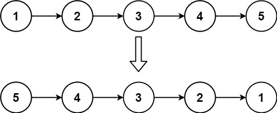

# 206. Reverse Linked List
[leetcode 206. Reverse Linked List](https://leetcode.com/problems/reverse-linked-list/)

Given the `head` of a singly linked list, reverse the list, and return the reversed list.

Example 1:


```
Input: head = [1,2,3,4,5]
Output: [5,4,3,2,1]
```

Example 2:


```
Input: head = [1,2]
Output: [2,1]
```

Example 3:
```
Input: head = []
Output: []
```

# Code

Python:
```python
class ListNode(object):
    def __init__(self, val=0, next=None):
        self.val = val
        self.next = next
        
class Solution(object):
    def reverseList(self, head):
        prev = None
        curr = head
        while curr:
            next = curr.next
            curr.next = prev
            prev = curr
            curr = next
        return prev
```

C++:
###### iterative
```C++
class Solution {
public:
    ListNode* reverseList(ListNode* head) {
        ListNode *prev = NULL, *cur=head, *tmp;
        while(cur){
            tmp = cur->next;
            cur->next = prev;
            prev = cur;
            cur = tmp;
        }
        return prev;
    }
};
```

###### recursive
```C++
class Solution {
public:
    ListNode* reverseList(ListNode* head) {
        if(!head || !(head->next))  return head;
        auto res = reverseList(head->next);
        head->next->next = head;
        head->next = NULL;
        return res;
    }
};
```


